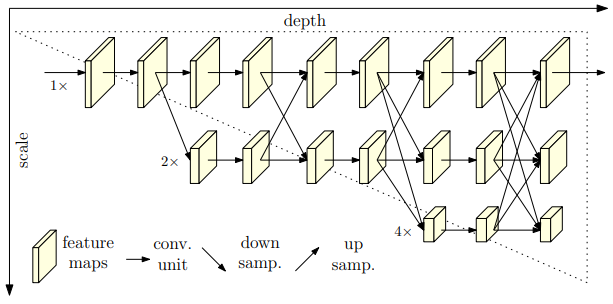
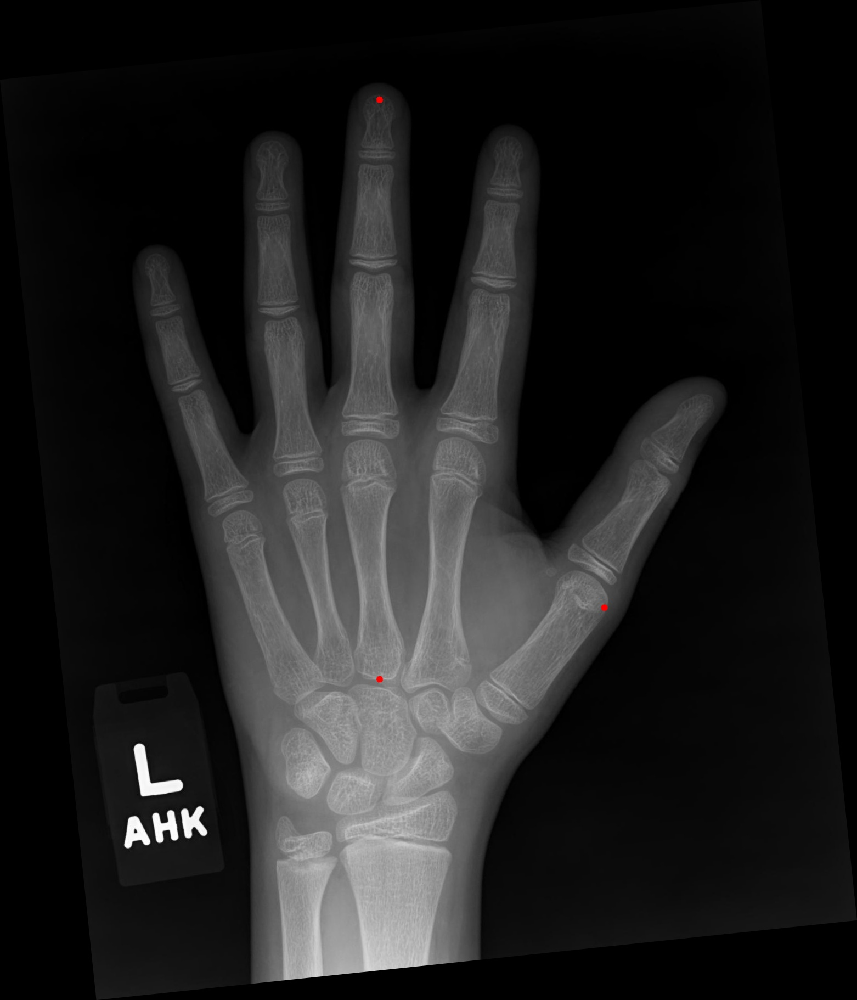
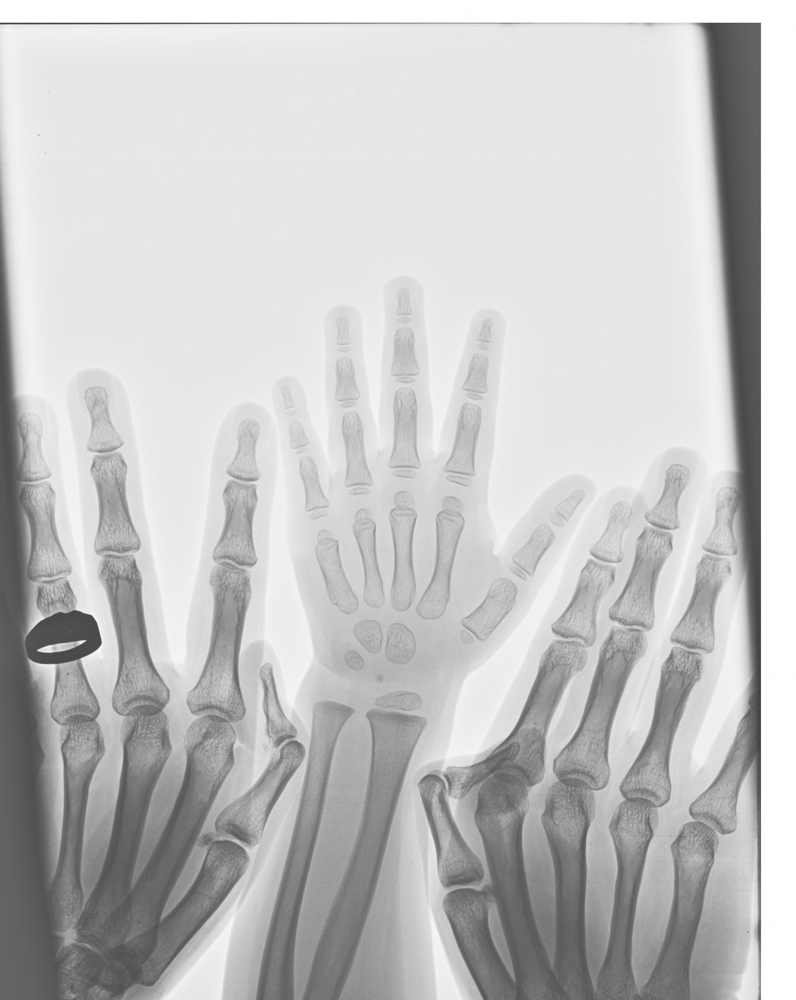
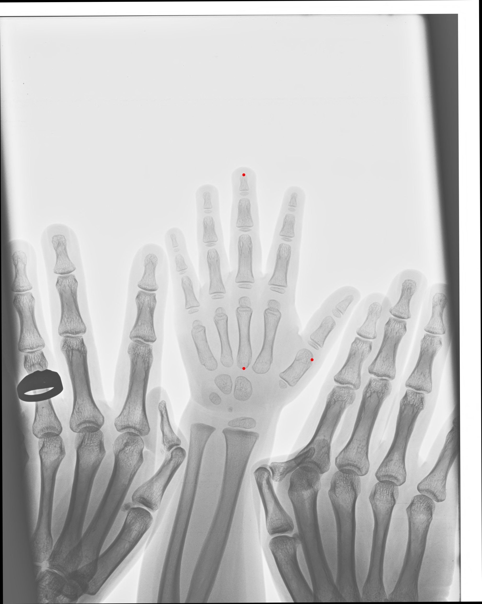
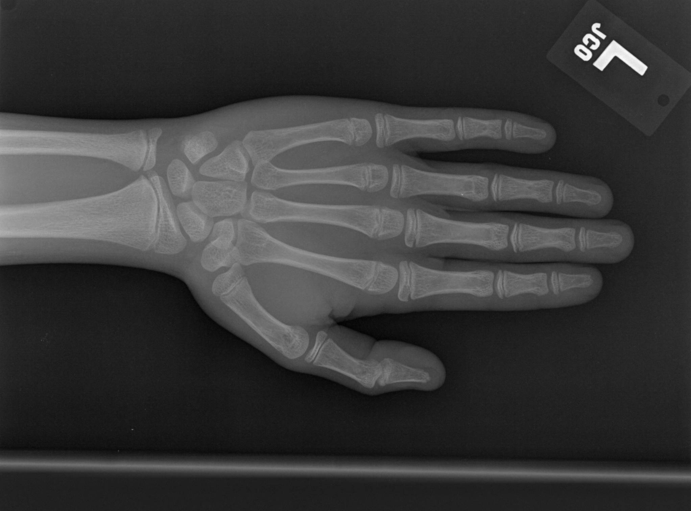
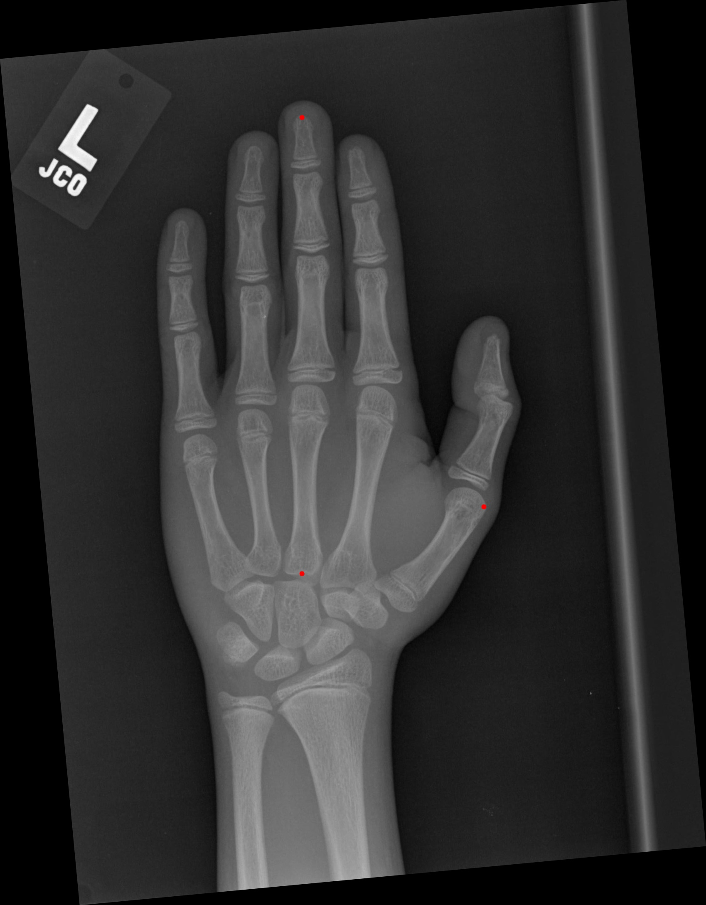
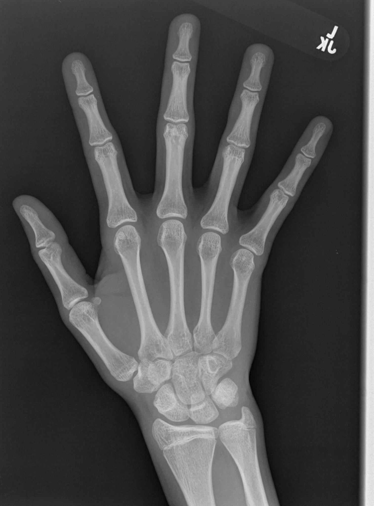
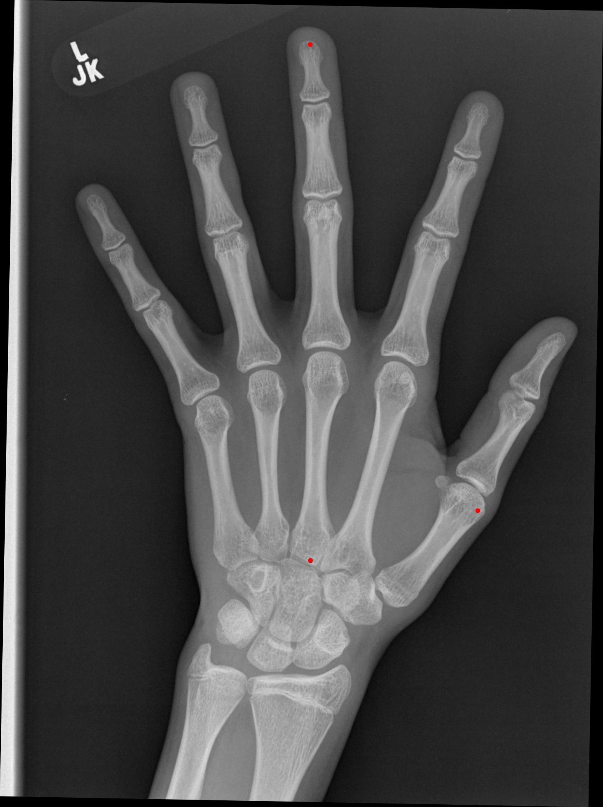
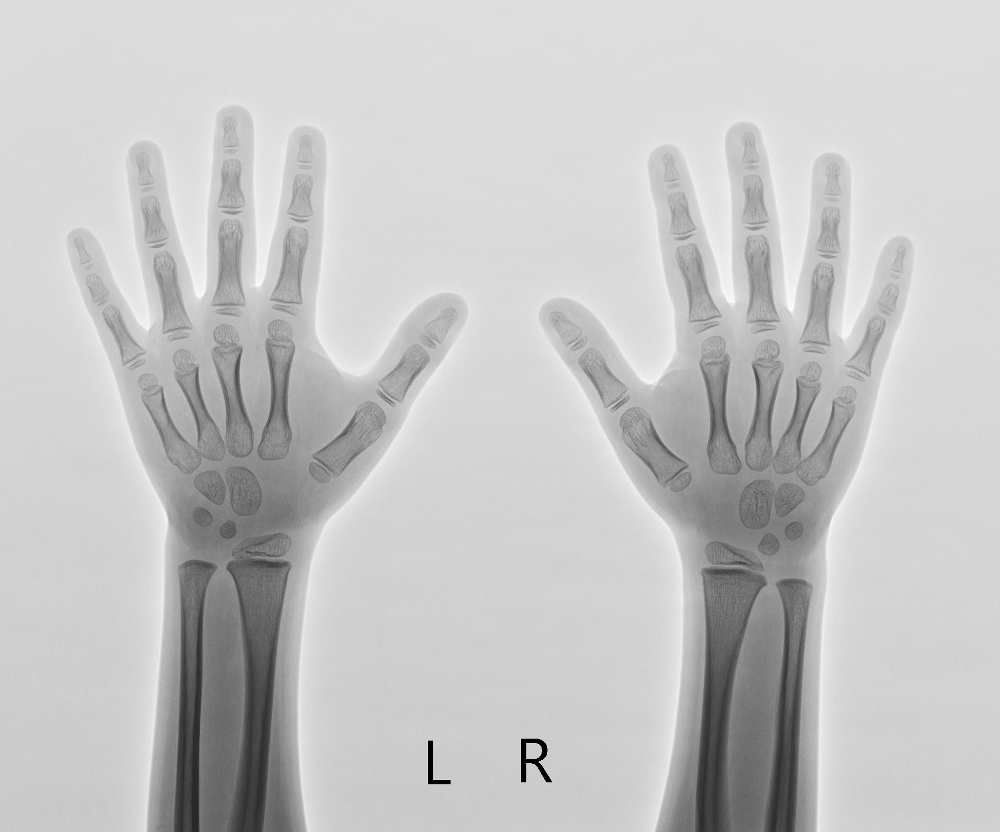
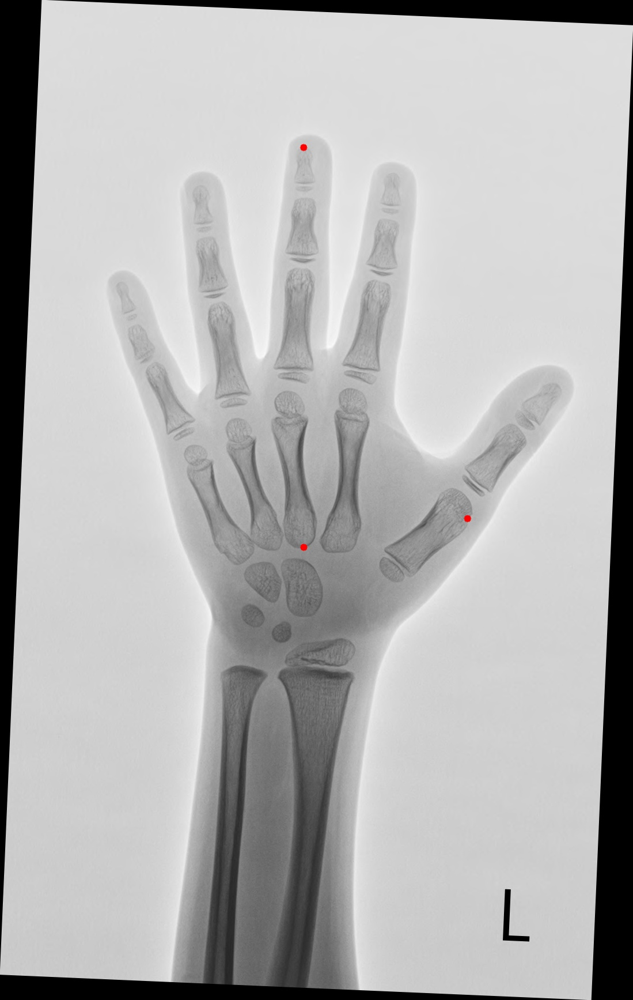

# 21_summer_internship
21년도 하계 인턴십 with_vision
 
<html>
  <head>
    <meta http-equiv="Content-Type" content="text/html; charset=utf-8"/>
  </head>
  <body>
    <article id="cfb586aa-aa88-48ab-acbf-c0bd53e9f503" class="page sans">
      <header>
        <h1 class="page-title">hrnet 학습 결과</h1>
      </header>
      

        <h1 id="4bd45150-08b9-4dfc-96f9-27df0cb3047a" class="">모델학습</h1>
        
model: hrnet_w32_256x192 사용

        <figure id="8ada5501-0041-40fc-8815-28659543efa2" class="image">
          
        </figure>
        
model1 = test loss : 0.0005 Accuracy : 100

        

        <h2 id="0362c558-e8a2-4210-88d5-a554d9decd3a" class="">테스트 지표 생성:</h2>
        
boundary_size = (top_y – middle_y)/ z 의 값을 기준으로 얼마나 벗어났는가를 판단.

        <figure id="aaa4694e-1781-426e-8efc-a988cd053aae" class="image">
          
        </figure>
        
boundary_size is 10, count of overrange : 0, Accuracy: 100.0%

        
boundary_size is 15, count of overrange : 0, Accuracy: 100.0%

        
boundary_size is 20, count of overrange : 1, Accuracy: 99.0%

        
boundary_size is 30, count of overrange : 14, Accuracy: 95%

        

        
성능을 개선하기 위해  기존  전체 사진기준 bbox를 좌표의 min,max값으로 bbox를 줄여 재학습을 진행함

        
model2 = test loss : 0.0001 Accuracy : 99

        

        <h2 id="deabca04-ea88-43dd-980c-a8794eac2424" class="">모델1 + 모델2를 결합하여 테스트를 진행한 결과:</h2>
        
boundary_size is 10, count of overrange : 0, Accuracy: 100.0%

        
boundary_size is 15, count of overrange : 0, Accuracy: 100.0%

        
boundary_size is 20, count of overrange : 0, Accuracy: 100.0%

        
boundary_size is 30, count of overrange : 0, Accuracy: 100.0%

        
boundary_size is 40, count of overrange : 4, Accuracy: 98.67549668874172%

        

        <h2 id="cdbfcd1a-27bb-459e-95fd-85fb0e16bba3" class="">모델을 통해 생성된 keypoint를 이용한 왼손 정방향 조정 코드:</h2>
        <pre id="8e83df17-2a69-4fa7-acb1-f2ff752d0c48" class="code">
        <code>
def rotation(image, angleInDegrees):
    h, w = image.shape[:2]
    img_c = (w / 2, h / 2)
    rot = cv2.getRotationMatrix2D(img_c, angleInDegrees, 1)
    rad = math.radians(angleInDegrees)
    sin = math.sin(rad)
    cos = math.cos(rad)
    b_w = int((h * abs(sin)) + (w * abs(cos)))
    b_h = int((h * abs(cos)) + (w * abs(sin)))
    rot[0, 2] += ((b_w / 2) - img_c[0])
    rot[1, 2] += ((b_h / 2) - img_c[1])
    outImg = cv2.warpAffine(image, rot, (b_w, b_h), flags=cv2.INTER_LINEAR)
    return outImg
def position_checker(image_path,top,middle,thumb):
    img = cv2.imread(image_path)
    try:
        angle = math.atan2(top[0]-middle[0],middle[1]-top[1])
        angle = math.degrees(angle)
        print(angle)
        #시계방향 90도
        if 45&lt;= angle&lt;=135:
            img = cv2.rotate(img, cv2.ROTATE_90_COUNTERCLOCKWISE)
            image_height, image_width = img.shape[0], img.shape[1]
            top[0], top[1] = top[1],image_height -  top[0]
            middle[0], middle[1] = middle[1], image_height - middle[0]
            thumb[0], thumb[1] = thumb[1], image_height - thumb[0]
        #반시계방향 90도
        elif -135&lt;= angle&lt;=-45:
            img = cv2.rotate(img, cv2.ROTATE_90_CLOCKWISE)
            image_height, image_width = img.shape[0], img.shape[1]
            top[0], top[1] = image_width - top[1], top[0]
            middle[0], middle[1] = image_width - middle[1], middle[0]
            thumb[0], thumb[1] = image_width - thumb[1], thumb[0]
        #180도
        elif 135&lt;= angle&lt;=225 or -225&lt;=angle&lt;=-135:
            img = cv2.rotate(img, cv2.ROTATE_180)
            image_height, image_width = img.shape[0], img.shape[1]
            top[0],top[1] = image_width - top[0],image_height-top[1]
            middle[0],middle[1] = image_width - middle[0],image_height - middle[1]
            thumb[0],thumb[1] = image_width - thumb[0],image_height - thumb[1]
        #좌우 대칭
        if middle[0] &gt; thumb[0]:
            img = cv2.flip(img, 1)
            image_height, image_width = img.shape[0], img.shape[1]
            top[0] = image_width - top[0]
            middle[0] = image_width - middle[0]
            thumb[0] = image_width - thumb[0]
        #양손 사진일 경우 왼손만 인식하기 위해 사진크기 조정
        image_height, image_width = img.shape[0], img.shape[1]
        if middle[0] &lt; image_width//2 and top[0]&lt; image_width//2 and thumb[0]&lt; image_width//2:
            flip_thumb_x = image_width - thumb[0]
            cutting_x_position = thumb[0]+flip_thumb_x/5
            img = img[0:image_height, 0: int(cutting_x_position)]
        #좌표에 점 찍기
        img = cv2.circle(img, (int(top[0]),int(top[1])), 6, (0, 0, 255), -1)
        img = cv2.circle(img, (int(middle[0]),int(middle[1])), 6, (0, 0, 255), -1)
        img = cv2.circle(img, (int(thumb[0]),int(thumb[1])), 6, (0, 0, 255), -1)
        angle = math.atan2(top[0] - middle[0], middle[1] - top[1])
        angle = math.degrees(angle)
        if -60&lt;=angle&lt;=60:
            img = rotation(img,angle)
            </code>
            </pre>
  <h2 id="24bda9a0-e73f-432f-bf06-69c0e4e1c7d3" class="">왼손 인식</h2>
  

    

      <figure id="d9da19c5-fae3-474c-8565-70a6331eace2" class="image">
        
      </figure>
      
원본사진

    

    

      <figure id="5bbfacb8-ae49-4152-bbdd-a2308e6a3df7" class="image">
        
      </figure>
      
조정된 사진

    

  

  <h2 id="77a3996d-99d1-48a0-a6f7-c1fe737e581d" class="">90도의 사진을 정방향으로 조정</h2>
  

    

      <figure id="e5d76168-f49e-4c00-a163-32033c6dc2a9" class="image">
        
      </figure>
      
원본사진

    

    

      <figure id="2859a162-1801-43b3-b0cf-57e5134d8d95" class="image">
        
      </figure>
      
조정된 사진

    

  

  <h2 id="34ead625-52ff-4de0-a2f1-ebfb28da93cd" class="">대칭된 사진을 정방향으로 조정</h2>
  

    

      <figure id="57dac6b1-afbc-4b4b-b071-2131ed0f6dce" class="image">
        
      </figure>
      
원본사진

    

    

      <figure id="2967e96b-8a0c-4647-bb38-c0aad03bd2a3" class="image">
        
      </figure>
      
조정된 사진

    

  

  <h2 id="91461e65-c179-45ca-8f56-fce493337518" class="">양손에서 왼손만 잘라서 사진 생성</h2>
  

    

      <figure id="44e46c47-5c1b-41d6-a4da-7e22cc1160ad" class="image">
        
      </figure>
      
원본사진

    

    

      <figure id="22e8c44b-194b-4935-a074-13e541a19627" class="image">
        
      </figure>
      
조정된 사진

    

  

  

  

  </article>
  </body>
</html>
